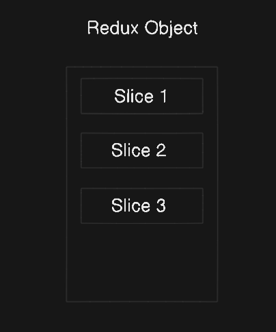
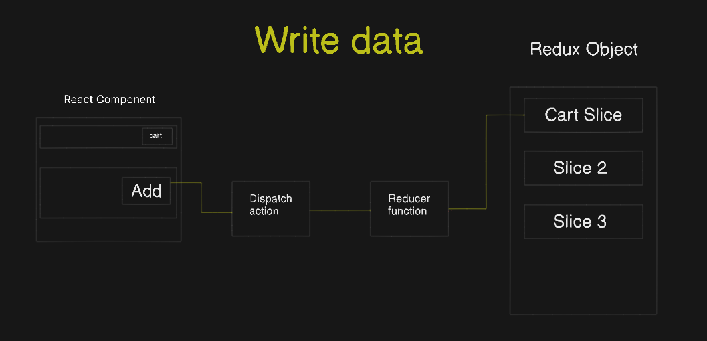
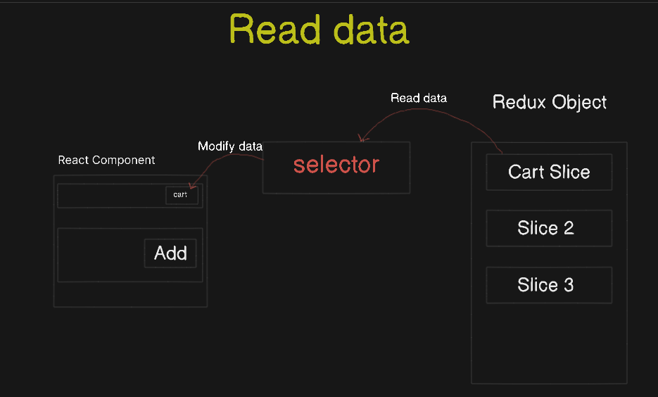
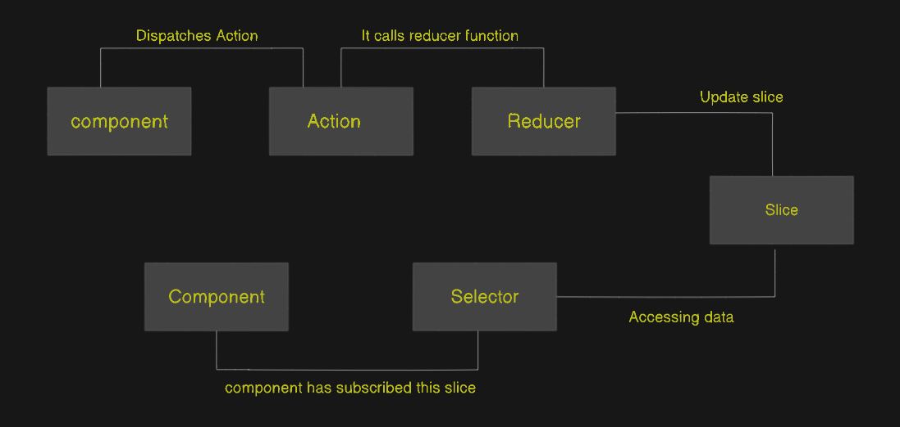

# What is Redux ?
Redux is another JS library & it is completely different from react, both are seperate. 

we ofently use Redux with react. redux can also be use in other libraries & framework.

# Why should we use Redux in our app ?
 you don't need to use redux in your every app, it's not neccesary.

 But when your application become big & you have to `handle a lot of data, manage different state` then redux will be your great choice.
 #### Advantage : 
 it actually helps you keep your `app organized, predictable, and easier to fix` when things go wrong.


 ## Now Let's talk about how Redux works using diagram.



* Basically Redux is a big JS object kept is single central place.
* Any component can access inside our application.
* It can write data, read data from object
* Major data kept here so that components can access.

To keep it from getting big or clumsy, we've `Slicing` in our redux store.

`slice is a small portion of redux store.We create multiple slices inside our redux store.`

`Slice is respnsible for tracking initial state of the store as well as all of our reducers are collected here`

#### Why do we need `Slice` ?

- to keep data seperate, make a logical partitions.
- Example : 
    - If we want to add cart data into our redux store we'll create a seperate slice for cart data.
    - Suppose we want to store logged in user information in our redux store, we'll create a user slice kind of things.

## How Does the data go from react component to a slice inside redux object / How to write data inside a slice 📝?

You can't directly modify our slice, we've to go through a 2 step process.

- Dispatch an action
    - action will call a function (which is known as `reducer`)



* EXAMPLE :
you want to add item which should show the cart box.

`BEHIND THE SCENES it works like this (shown above diagram) in redux`

* when you click add button to add that item on your cart ->
    * first,it'll dispatch an action
    * and then it'll call a function which is known as `reducer` in redux.
    * and finally this reducer function will modify the slice.

This is how the write operation performs in redux.

# How Does the data come to react component from a slice inside redux object / How to read or access data from a slice ?

* To get data from our redux store we've something called  `selector.`
    * we use `selector` to read the data from our store/slice. And the <i>selector</i> modify or update our react component.

    * `Selector is nothing but a hook (which is a function) inside react`


    


* <i>When we use selector, the phenomenon is known as `Subscribing to the store`</i>

* Basically, using selector, we're identifying some of the portion of our store from where we want to read data.

* Example : Let's say you want to update a header component. to do so this component have to subscribe the store using selector.


## Fig : Readux workflow (Final Diagram)




### Example of how to use redux in code

* install redux packages
    - npm install @reduxjs/toolkit
    - npm install react-redux


### Step - 1 : Create a store

To create a store we have a function `configureStore`

### Step - 2 : Create slices
        
To create a store we have a function `createSlice`, it takes 3 things inside of it
- name of the slice
- initialState
- reducers

there are 2 compulsory things that you've to pass on the every reducers which are `state` & `action`

* export 2 things from slice
    - export our action (each method which is there on the reducers)
    - export our reducer  (entire reducer)

### step - 3 : import slice in your store

### step - 4 provide this store to the application using <i> Provider </i>


## How to write data & send into the store?
  - we need `useDispatch` which is a 2 step process
    - import `useDispatch` (from react-redux) & `action`  (which you want to use particularly) 

    - obtain the `dispatch` function from the Redux store (rhis function is used to send actions to the store) & use it where you need
    
    ```
    import {useDispatch} from 'react-redux'
    import {addTodo} from 'file path'

    const dispatch = useDispatch();     //obtain fnx

    dispatch(addTodo(input));         // using it by passing action
    
    ```
 

## How to read/access data from the store ?
 - to read from store, we need `useSelector` hook ;
  `useSelector hook is a method which gives us access to the state(which is a object) & grab what we need from store`

  * How to use this hook
     1. import  `useSelector` in your component
     2. selecting the portion you want to use using this hook
          - Now use your selected data wherever you want to

     Ex :
     ```
      import { useSelector } from 'react-redux'

      const todos = useSelector(state => state.todoS)
      // const selectData = useSelector(state => state.somePortionOfState)
     ```


<b style = "color : pink "> Yep, that's all about redux 😎 </b>